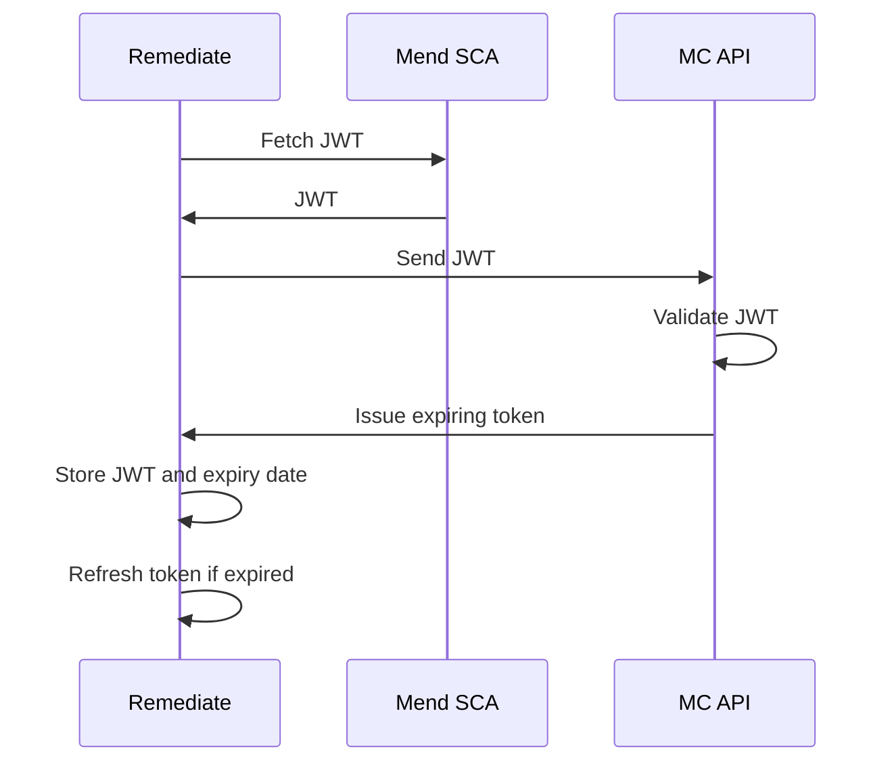

```mermaid
sequenceDiagram
    participant Remediate
    participant Mend SCA
    participant MC API
    Remediate->>Mend SCA: Fetch JWT
    Mend SCA->>Remediate: JWT
    Remediate->>MC API: Send JWT
    MC API->>MC API: Validate JWT
    MC API->>Remediate: Issue expiring token
    Remediate->>Remediate: Store JWT and expiry date
    Remediate->>Remediate: Refresh token if expired
```
